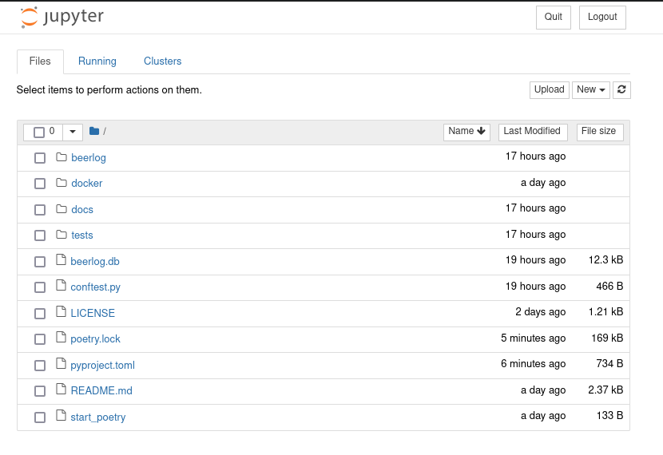
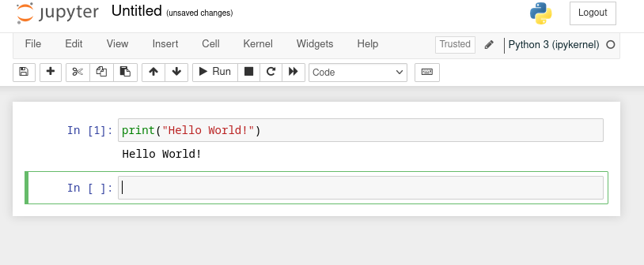
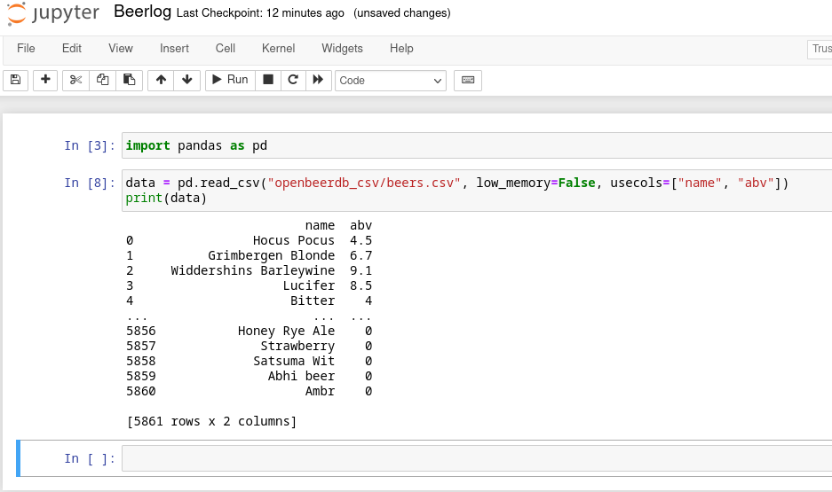
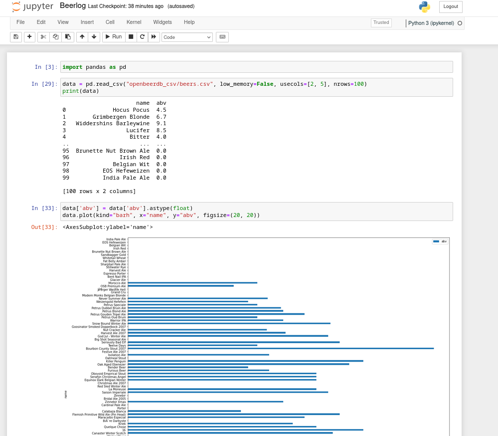
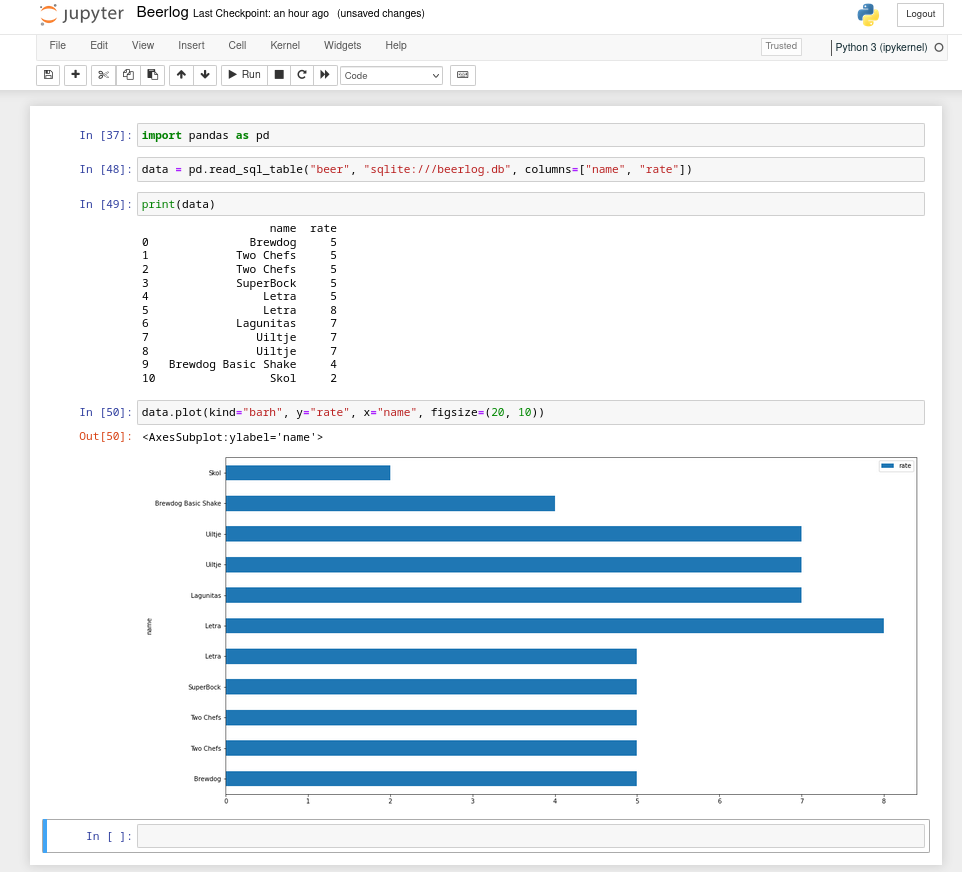
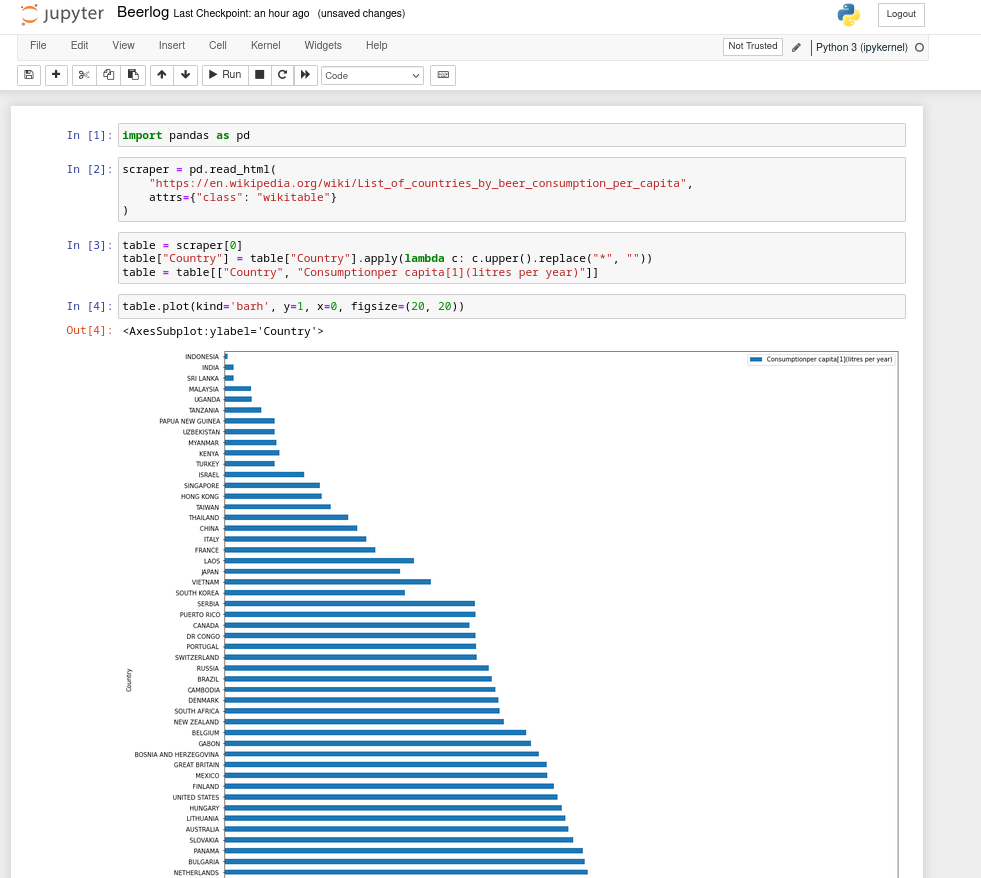

# Containers


- O que são containers?
- Por que usar containers?


## Rodando o `beerlog` em um container


Vamos criar um arquivo em `docker/Dockerfile`, este arquivo contém a declaração do passo a passo para
o docker (ou outro builder de containers) criar uma imagem a partir das nossas instruções.

Este Dockerfile tem as seguintes carecteristicas

- Define variáveis para serem reutilizadas com `ARG`
- Utiliza uma imagem base comum para o build com `FROM`
- Utiliza uma abordagemm chamada `multi stage build` para que a imagem possa
  ser criada para diversos ambientes, `staging`, `development` e `production`
- Utiliza um `entrypoint.sh`, um script shell que permite acessar variáveis de ambiente

Além disso nesta imagem fazemos algumas otimizações referentes a instalação e build do projeto:

- O poetry só deve ser usado em ambiente de development e testes, para produção a prática é exportar
  para um formato padrão `requirements.txt` e instalar com o `pip`
- Adicionamos variáveis de ambiente para economizar espaço em disco no build do Python com `ENV PYTHON*`
- Adicionamos variáveis para configurar o Poetry em modo headless
- No estágio de build "compilamos" o programa Python para o formato binário `.whl`


```dockerfile
ARG APP_NAME=beerlog
ARG APP_PATH=/opt/$APP_NAME
ARG PYTHON_VERSION=3.8.13
ARG POETRY_VERSION=1.1.13

# Stage: staging
FROM python:$PYTHON_VERSION as staging
ARG APP_NAME
ARG APP_PATH
ARG POETRY_VERSION

ENV \
    PYTHONDONTWRITEBYTECODE=1 \
    PYTHONUNBUFFERED=1 \
    PYTHONFAULTHANDLER=1
ENV \
    POETRY_VERSION=$POETRY_VERSION \
    POETRY_HOME="/opt/poetry" \
    POETRY_VIRTUALENVS_IN_PROJECT=true \
    POETRY_NO_INTERACTION=1

# Install Poetry - respects $POETRY_VERSION & $POETRY_HOME
RUN curl -sSL https://raw.githubusercontent.com/python-poetry/poetry/master/install-poetry.py | python
ENV PATH="$POETRY_HOME/bin:$PATH"

# Import our project files
WORKDIR $APP_PATH
COPY ./poetry.lock ./pyproject.toml ./
COPY ./$APP_NAME ./$APP_NAME

# Stage: development
FROM staging as development
ARG APP_NAME
ARG APP_PATH
WORKDIR $APP_PATH
RUN poetry install
ENTRYPOINT ["poetry", "run"]
CMD ["uvicorn", "beerlog.api:api", "--host=0.0.0.0","--port=8000","--reload"]

# Stage: build
FROM staging as build
ARG APP_PATH

WORKDIR $APP_PATH
RUN poetry build --format wheel
RUN poetry export --format requirements.txt --output constraints.txt --without-hashes

# Stage: production
FROM python:$PYTHON_VERSION as production
ARG APP_NAME
ARG APP_PATH

ENV \
    PYTHONDONTWRITEBYTECODE=1 \
    PYTHONUNBUFFERED=1 \
    PYTHONFAULTHANDLER=1

ENV \
    PIP_NO_CACHE_DIR=off \
    PIP_DISABLE_PIP_VERSION_CHECK=on \
    PIP_DEFAULT_TIMEOUT=100
ENV \
    PORT=8000

# Get build artifact wheel and install it respecting dependency versions
WORKDIR $APP_PATH
COPY --from=build $APP_PATH/dist/*.whl ./
COPY --from=build $APP_PATH/constraints.txt ./
RUN pip install ./$APP_NAME*.whl --constraint constraints.txt

COPY ./docker/entrypoint.sh /entrypoint.sh
RUN chmod +x /entrypoint.sh
ENTRYPOINT ["/entrypoint.sh"]
CMD ["uvicorn", "beerlog.api:api", "--host=0.0.0.0","--port=$PORT"]
```

e um `docker/entrypoint.sh`


```sh
#!/bin/sh
set -e
eval "exec $@"
```

Para fazer o build.

```bash
docker build -t beerlog/prod --file docker/Dockerfile .
```

Para rodar

```bash
# e
docker run -p 8000:8000 beerlog/prod

# ou para alterar a porta
docker run -p 8000:5000 -e PORT=5000 beerlog/prod
```

Para a imagem de development

```bash
docker build --target development -t beerlog/dev --file docker/Dockerfile .
```

Nessa outra branch https://github.com/rochacbruno/python-week-2022/tree/day2_com_pgsql tem um docker-compose com o banco de dados PostgreSQL usando essa imagem docker que criamos.


# Parte 2 Analise de dados com Python

Python é uma linguagem muito utilizada para análise de dados e se tornou de fato a principal linguagem
nas areas de Data Science, Jornalismo de dados, estatistica e BI.

Vamos conhecer algumas ferramentas do Python para análise de dados.

> **DISCLAIMER** Eu, Bruno, não sou um profissional da area de ciência de dados , portanto o conhecimento que passarei
> nesta parte será bastante limitado. Recomendo outros canais para quem deseja aprofundar no tema.

## Jupyter

Jupyter é um projeto que nasceu do `ipython` o terminal interativo e antigamente se chamava `ipython notebooks` porém
ganhou muitas melhorias e suporte a várias linguagens e adotou o nome `Jupyter`, a idéia do Jupyter era juntar
as 3 principais linguagens usadas em data science (JUlia, PYThon E R).

Ele é uma ferramenta que roda com 2 serviços principais, um chamado de `jupyter kernel` que é onde o código é executado
e outro chamado `jupyter notebook` que funciona como front-end para esse kernel.

O código é escrito no front usando o browser e executado no lado servidor no kernel.

No gitpod o Jupyter já vem instalado mas é interessante instalar alguma dependencias

```bash
poetry add jupyter matplotlib lxml bs4 requests html5lib
```

## Como utilizar o Jupyter?

Primeiro definimos o password do nosso server

```bash
jupyter notebook password
```

agora ao executar com

```
jupyter notebook
```
Ou no gitpod usando

```
jupyter notebook --NotebookApp.allow_origin=\'$(gp url 8888)\'
```

no terminal obtemos uma instância do servidor rodando em uma porta `8888`

Essa é a interface inicial do Jupyter




Agora podemos criar um novo notebook clicando em `new`


O Jupyter funciona com o sistema de células
onde cada bloco de código é separado e pode ser executado individualmente.




> Opcionalmente também podemos usar o https://colab.research.google.com/ que é um serviço do google para usar o Jupyter online.

## ETL

Extract Transform Load

É o processe de **extrair** informações das mais variadas fontes como arquivos, bancos de dados, páginas web.

**Transformar** tratando e organizando em um formato fácil de manusear.

e finalmente **Carregar** esses dados em modelos de machine learning, bancos de dados etc...

## Pandas

Pandas é uma biblioteca que inclui uma variedade imensa de módulos úteis para analisar dados com Python e entre outras coisas o Pandas consegue

- Extrair dados de diversas fontes
- Transformar dados usando Series e Dataframes
- Plotar os dados em gráficos
- Realizar operações computacionais em cima dos dados.

Exemplos:


### Lendo um `.csv` com pandas.

Vamos usar o https://openbeerdb.com/ que fornece um arquivo .csv com milhares de dados sobre cervejas este é o link para baixar o arquivo.

https://openbeerdb.com/files/openbeerdb_csv.zip

No terminal

```bash
wget https://openbeerdb.com/files/openbeerdb_csv.zip
unzip openbeerdb_csv.zip
```

Agora temos uma pasta `openbeerdb_csv` com alguns dados para analisar.




Repare que temos 5861 registros para analisar.

O que fazer com essa informação?





## Analisando os dados do Beerlog





## Analisando dados da web





> **DICA** O jupyter também funciona integrado ao Vscode `code Beerlog.ipynb` 